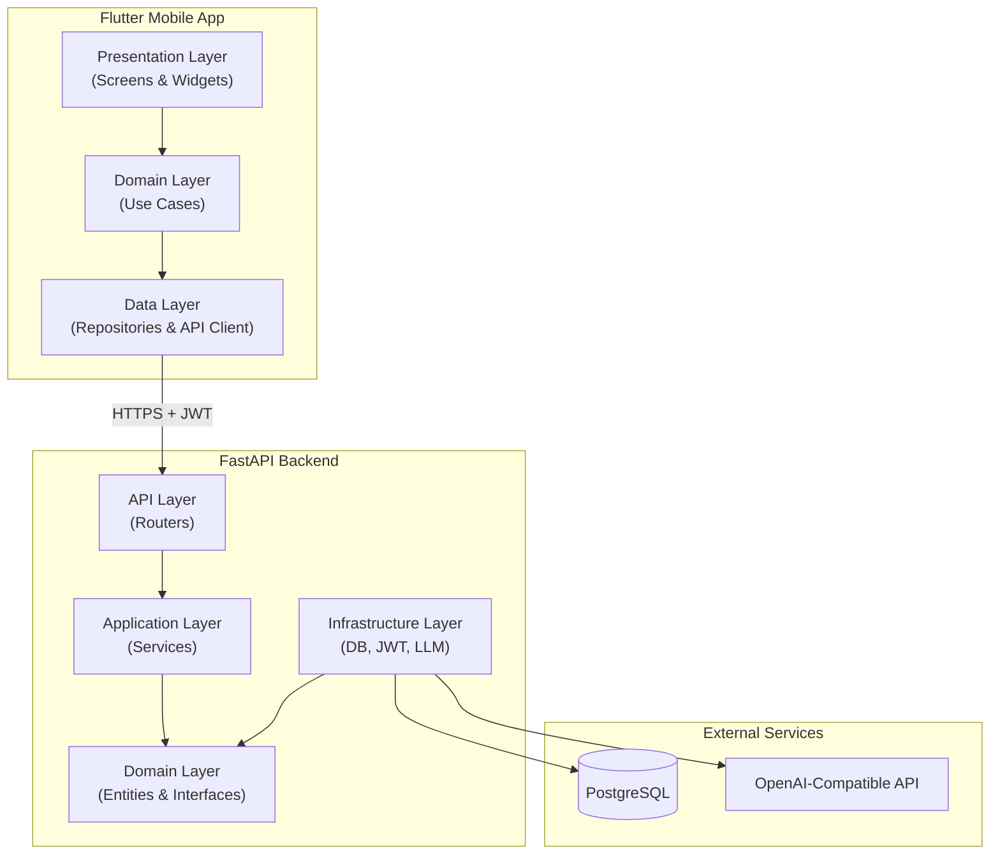
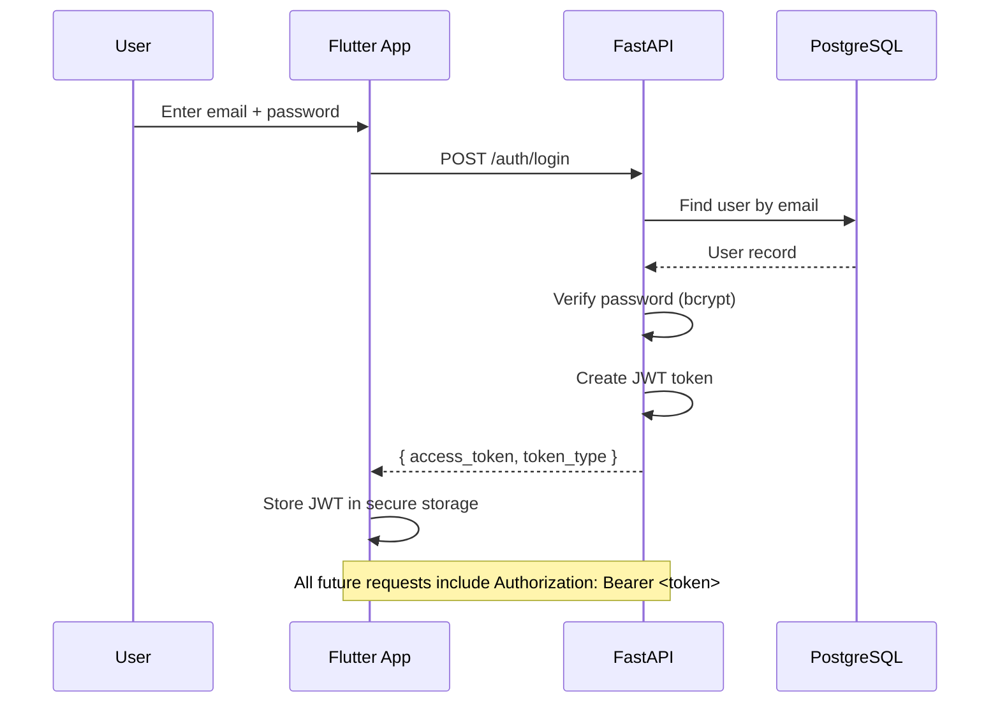
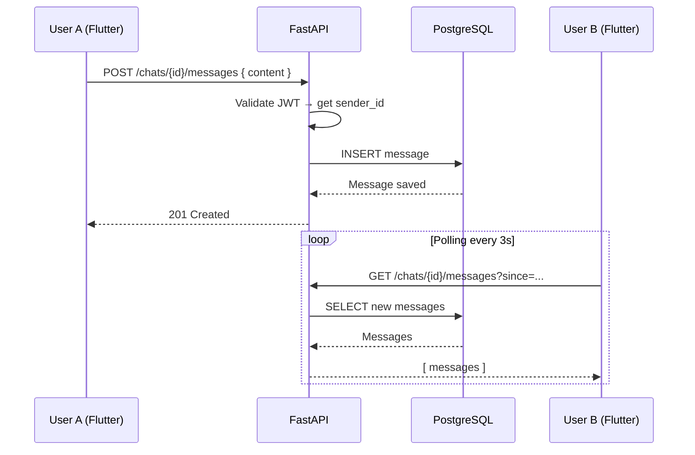
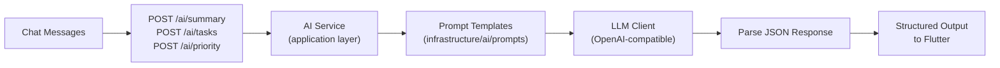
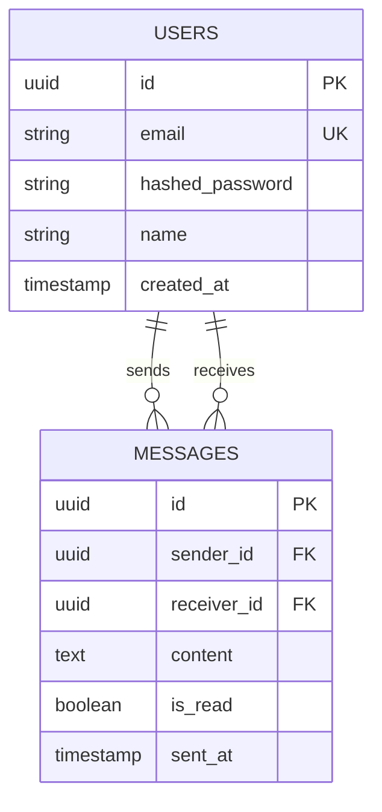

# Architecture — AI-First Communication POC

## Vision

Prove that **conversations can automatically become actionable** — summaries, tasks,
events, and priorities extracted from chat without manual effort.

This is not a WhatsApp competitor. It is a **proof of concept** for AI-augmented messaging.

---

## System Overview



---

## Clean Architecture — Both Sides

### The Dependency Rule

Dependencies always point **inward**. Outer layers depend on inner layers, never the reverse.

```
Presentation  →  Application  →  Domain  ←  Infrastructure
   (UI)           (use cases)    (entities)    (DB, HTTP, AI)
```

### Backend Layers

| Layer | Folder | Responsibility | Depends On |
|-------|--------|----------------|------------|
| API | `app/api/` | HTTP routes, JSON validation | application, core |
| Application | `app/application/` | Use case orchestration | domain |
| Domain | `app/domain/` | Entities, repository interfaces | nothing |
| Infrastructure | `app/infrastructure/` | SQLAlchemy, JWT, LLM client | domain |
| Core | `app/core/` | Config, shared utilities | nothing |

### Frontend Layers (per feature)

| Layer | Folder | Responsibility | Depends On |
|-------|--------|----------------|------------|
| Presentation | `features/*/presentation/` | Screens, widgets, state | domain |
| Domain | `features/*/domain/` | Entities, use cases, repo interfaces | nothing |
| Data | `features/*/data/` | API calls, DTOs, repo implementations | domain, core |

---

## Authentication Flow (Phase 2)



---

## Chat Flow (Phase 3)



---

## AI Pipeline (Phase 4)



### AI Module Outputs

| Module | Input | Output |
|--------|-------|--------|
| Summary | Full conversation | 3–5 bullet points (string list) |
| Task Extraction | Message text | `{ tasks: [...], events: [...] }` |
| Priority Detection | Message text | `{ category: "work" \| "personal" \| "reminder" \| "promotion" }` |

---

## Database Schema (Planned)



No separate `chats` table for the POC — a conversation is implied by the pair
of `(sender_id, receiver_id)`. We can normalize later if needed.

---

## SOLID Principles Applied

| Principle | How We Apply It |
|-----------|-----------------|
| **S** — Single Responsibility | Each service/use case does one thing (e.g. `LoginUser`, `SendMessage`) |
| **O** — Open/Closed | New AI modules added without changing existing code |
| **L** — Liskov Substitution | Any `UserRepository` implementation works interchangeably |
| **I** — Interface Segregation | Small, focused repository interfaces (not one giant `Repository`) |
| **D** — Dependency Inversion | Application depends on abstract interfaces, not SQLAlchemy directly |

---

## Security Considerations (POC Level)

- Passwords hashed with **bcrypt** (never stored plain)
- JWT tokens with expiration (60 min default)
- API keys for LLM stored in `.env` (backend only — never in Flutter)
- CORS configured to allow only the Flutter app's origin
- Input validation via Pydantic (backend) and form validators (Flutter)

---

## What We Are NOT Building (POC Scope)

- Voice / video calls
- Media / file sharing
- Group chats
- Push notifications
- End-to-end encryption
- Production deployment / CI/CD
- Fancy UI / animations
