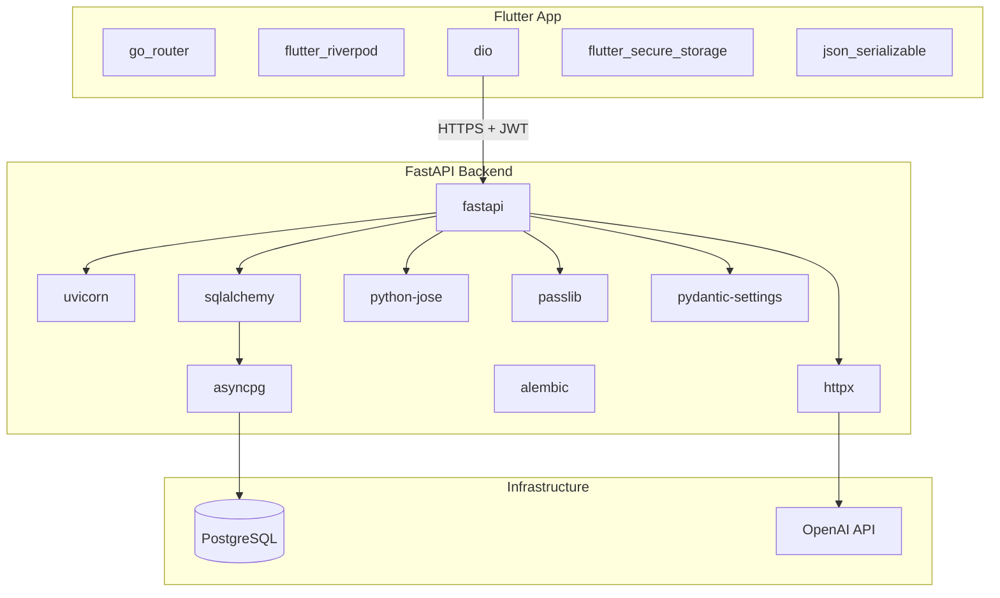

# Dependencies Explained

This document explains **every dependency** in the project and **why** we chose it.
Think of this as your cheat sheet when you see an unfamiliar package name.

---

## Backend (Python)

### Web Framework

| Package | Purpose | Why This One |
|---------|---------|--------------|
| **fastapi** | Web framework | Async-native, auto-generates API docs at `/docs`, excellent Pydantic integration. Industry standard for modern Python APIs. |
| **uvicorn** | ASGI server | Runs FastAPI. The `[standard]` extra includes `uvloop` for better performance. |

### Database

| Package | Purpose | Why This One |
|---------|---------|--------------|
| **sqlalchemy** | ORM (Object-Relational Mapper) | Maps Python classes to database tables. You write Python, not raw SQL. Version 2.0 has excellent async support. |
| **asyncpg** | PostgreSQL driver | Fast async driver. SQLAlchemy uses it under the hood for `postgresql+asyncpg://` URLs. |
| **alembic** | Migrations | Version-controls your database schema. Like `git` but for table structures. Run `alembic upgrade head` to apply changes. |

**Concept for you:** An ORM lets you do `user = User(email="a@b.com")` instead of `INSERT INTO users (email) VALUES ('a@b.com')`. It handles the SQL for you.

### Authentication

| Package | Purpose | Why This One |
|---------|---------|--------------|
| **python-jose** | JWT tokens | Creates and validates JSON Web Tokens. JWT is a standard way to prove "this user is logged in" without server-side sessions. |
| **passlib[bcrypt]** | Password hashing | Converts passwords into irreversible hashes. Even if the DB is leaked, passwords are safe. |
| **python-multipart** | Form parsing | FastAPI needs this to read form data (used in OAuth2 password flow). |

**Concept for you:** JWT works like a stamped ticket. The backend stamps it at login; Flutter shows it on every request. The backend checks the stamp instead of looking up a session.

### Configuration

| Package | Purpose | Why This One |
|---------|---------|--------------|
| **pydantic-settings** | Settings from `.env` | Loads `DATABASE_URL`, `JWT_SECRET_KEY`, etc. from environment variables with type validation. |
| **python-dotenv** | `.env` file reader | Lets you keep secrets out of code. Copy `.env.example` → `.env` and fill in values. |

### HTTP Client (AI)

| Package | Purpose | Why This One |
|---------|---------|--------------|
| **httpx** | Async HTTP client | Calls OpenAI-compatible APIs from the backend. Async so it doesn't block other requests while waiting for the LLM. |

### Development

| Package | Purpose | Why This One |
|---------|---------|--------------|
| **pytest** | Test runner | Standard Python testing framework. |
| **pytest-asyncio** | Async test support | Lets you `await` in test functions. |

---

## Frontend (Flutter / Dart)

### HTTP

| Package | Purpose | Why This One |
|---------|---------|--------------|
| **dio** | HTTP client | More powerful than Dart's built-in `http` package. Supports interceptors (auto-attach JWT), timeouts, and request/response logging. |

**Concept for you:** `dio` is Flutter's equivalent of Python's `httpx`. Every API call from Flutter goes through a shared `Dio` instance configured in `core/network/api_client.dart`.

### State Management

| Package | Purpose | Why This One |
|---------|---------|--------------|
| **flutter_riverpod** | State management | Manages app state reactively. When login succeeds, all widgets watching the auth state rebuild automatically. Recommended for beginners — less boilerplate than BLoC. |

**Concept for you:** In Flutter, when data changes (e.g. user logs in), the UI needs to update. Riverpod is the "glue" that connects data changes to UI rebuilds. Think of it as an observable variable that widgets can watch.

### Secure Storage

| Package | Purpose | Why This One |
|---------|---------|--------------|
| **flutter_secure_storage** | Encrypted local storage | Stores JWT tokens securely on the device (Keychain on iOS, EncryptedSharedPreferences on Android). Never store tokens in plain SharedPreferences. |

### JSON Serialization

| Package | Purpose | Why This One |
|---------|---------|--------------|
| **json_annotation** | Code generation annotations | Marks Dart classes for auto-generated `fromJson` / `toJson` methods. |
| **json_serializable** | JSON code generator | Generates the serialization boilerplate so you don't write it by hand. |
| **build_runner** | Code generation runner | Executes `json_serializable` code generation. Run: `dart run build_runner build`. |

**Concept for you:** FastAPI returns JSON like `{"email": "a@b.com", "name": "Alice"}`. Flutter needs a Dart object. `json_serializable` auto-generates the conversion code.

### Navigation

| Package | Purpose | Why This One |
|---------|---------|--------------|
| **go_router** | Declarative routing | Manages screen navigation with URL-like paths (`/login`, `/chat/:id`). Handles deep links and redirect logic (e.g. redirect to login if not authenticated). |

---

## Infrastructure

| Tool | Purpose | Why This One |
|------|---------|--------------|
| **PostgreSQL 16** | Relational database | Robust, free, excellent for structured data (users, messages). Runs via Docker for easy local setup. |
| **Docker Compose** | Container orchestration | Starts PostgreSQL with one command: `docker compose up -d`. No manual PostgreSQL installation needed. |

---

## Dependency Graph

---

## What You Do NOT Need to Install Manually

| Tool | How It Gets Installed |
|------|----------------------|
| PostgreSQL | `docker compose up -d` (Docker image) |
| Python packages | `pip install -r requirements.txt` |
| Flutter packages | `flutter pub get` |
| Flutter SDK | Install separately from https://flutter.dev |
