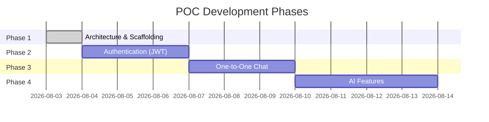

# Project Roadmap

## Overview

We build this POC in **four phases**, each adding a vertical slice of functionality.
Every phase ends with a working, testable feature before moving on.

---

## Phase 1 — Project Architecture ✅ (Current)

**Goal:** Establish folder structure, document architecture, define dependencies.

**Deliverables:**
- [x] Backend folder structure (`backend/app/`)
- [x] Frontend folder structure (`frontend/lib/`)
- [x] Architecture diagram (`docs/architecture.md`)
- [x] Dependency explanation (`docs/dependencies.md`)
- [x] Docker Compose for PostgreSQL
- [x] `.env.example` with all config keys
- [x] This roadmap

**No application logic.** Awaiting your approval before Phase 2.

---

## Phase 2 — Authentication

**Goal:** Users can register, login, and logout. JWT secures all API endpoints.

### Backend Tasks

| # | Task | Files Created |
|---|------|---------------|
| 2.1 | Database setup (SQLAlchemy + Alembic) | `core/database.py`, `alembic/` |
| 2.2 | User entity and repository | `domain/entities/user.py`, `domain/repositories/` |
| 2.3 | User DB model and repo impl | `infrastructure/database/models/`, `infrastructure/database/repositories/` |
| 2.4 | Password hashing + JWT helpers | `core/security.py` |
| 2.5 | Auth service (register, login) | `application/auth_service.py` |
| 2.6 | Auth API routes | `api/routes/auth.py`, `api/schemas/auth.py` |
| 2.7 | JWT dependency (protect routes) | `api/deps.py` |
| 2.8 | Wire everything in `main.py` | `main.py` |

### Frontend Tasks

| # | Task | Files Created |
|---|------|---------------|
| 2.9 | `flutter create` scaffold | Project boilerplate |
| 2.10 | API client with Dio | `core/network/api_client.dart` |
| 2.11 | Auth data layer | `features/auth/data/` |
| 2.12 | Auth domain layer | `features/auth/domain/` |
| 2.13 | Login & Register screens | `features/auth/presentation/` |
| 2.14 | Auth state (Riverpod) | `features/auth/presentation/providers/` |
| 2.15 | Route guards (redirect if not logged in) | `core/router/` |

### API Endpoints

| Method | Path | Auth Required |
|--------|------|---------------|
| POST | `/auth/register` | No |
| POST | `/auth/login` | No |
| POST | `/auth/logout` | Yes |
| GET | `/auth/me` | Yes |

### How to Verify

1. `docker compose up -d` → PostgreSQL running
2. `uvicorn app.main:app --reload` → API at http://localhost:8000/docs
3. `flutter run` → Login screen appears
4. Register a user → Login → See a placeholder home screen

---

## Phase 3 — One-to-One Chat

**Goal:** Two users can send and receive text messages. Messages persist in PostgreSQL.

### Backend Tasks

| # | Task | Files Created |
|---|------|---------------|
| 3.1 | Message entity and repository | `domain/entities/message.py` |
| 3.2 | Message DB model and repo impl | `infrastructure/database/models/message.py` |
| 3.3 | Chat service (send, list, mark read) | `application/chat_service.py` |
| 3.4 | Chat API routes | `api/routes/chat.py`, `api/schemas/chat.py` |

### Frontend Tasks

| # | Task | Files Created |
|---|------|---------------|
| 3.5 | Chat data layer | `features/chat/data/` |
| 3.6 | Chat domain layer | `features/chat/domain/` |
| 3.7 | Chat list screen | `features/chat/presentation/screens/chat_list_screen.dart` |
| 3.8 | Chat thread screen | `features/chat/presentation/screens/chat_screen.dart` |
| 3.9 | Message polling | `features/chat/data/datasources/chat_remote_datasource.dart` |

### API Endpoints

| Method | Path | Auth Required |
|--------|------|---------------|
| GET | `/chats` | Yes |
| GET | `/chats/{user_id}/messages` | Yes |
| POST | `/chats/{user_id}/messages` | Yes |
| PATCH | `/messages/{id}/read` | Yes |

### How to Verify

1. Login as User A in one emulator, User B in another
2. User A sends "Hello" → appears in User B's chat
3. Restart the app → messages still there (persisted in DB)

---

## Phase 4 — AI Features

**Goal:** Extract actionable intelligence from conversations.

### Backend Tasks

| # | Task | Files Created |
|---|------|---------------|
| 4.1 | LLM client (OpenAI-compatible) | `infrastructure/ai/llm_client.py` |
| 4.2 | Prompt templates | `infrastructure/ai/prompts/` |
| 4.3 | Summary service | `application/ai/summary_service.py` |
| 4.4 | Task extraction service | `application/ai/task_extraction_service.py` |
| 4.5 | Priority detection service | `application/ai/priority_service.py` |
| 4.6 | AI API routes | `api/routes/ai.py`, `api/schemas/ai.py` |

### Frontend Tasks

| # | Task | Files Created |
|---|------|---------------|
| 4.7 | AI data layer | `features/ai/data/` |
| 4.8 | AI domain layer | `features/ai/domain/` |
| 4.9 | Insights screen | `features/ai/presentation/screens/insights_screen.dart` |
| 4.10 | "Analyze" button on chat screen | Widget in chat presentation |

### API Endpoints

| Method | Path | Input | Output |
|--------|------|-------|--------|
| POST | `/ai/summary` | `{ chat_id }` | `{ bullets: ["...", "..."] }` |
| POST | `/ai/tasks` | `{ message_id }` or `{ text }` | `{ tasks: [...], events: [...] }` |
| POST | `/ai/priority` | `{ message_id }` or `{ text }` | `{ category: "work" }` |

### How to Verify

1. Have a conversation with messages like "Let's meet tomorrow at 6. Bring the laptop."
2. Tap "Analyze" → see summary bullets, extracted tasks, and priority category
3. Verify JSON structure matches the spec

---

## Future Enhancements (Out of POC Scope)

These are documented for awareness but will **not** be built unless you ask:

- WebSocket real-time messaging (replace polling)
- Group chats
- Push notifications
- Message search
- User profile photos
- Dark mode
- Offline message queue
- Rate limiting on AI endpoints
- Streaming LLM responses
- Multi-provider LLM fallback

---

## Decision Log

| Decision | Choice | Rationale |
|----------|--------|-----------|
| State management | Riverpod | Simpler than BLoC for a beginner; good docs |
| HTTP client | Dio | Interceptors for JWT; better error handling |
| ORM | SQLAlchemy 2.0 async | Industry standard; async matches FastAPI |
| Real-time | Polling (POC) | Simplest to implement; WebSockets later |
| AI location | Backend only | Keeps API keys secure; centralizes prompts |
| Chat model | Direct messages (no chat table) | Simpler schema for 1:1 POC |
| UI framework | Material (minimal) | Built into Flutter; no extra design deps |
