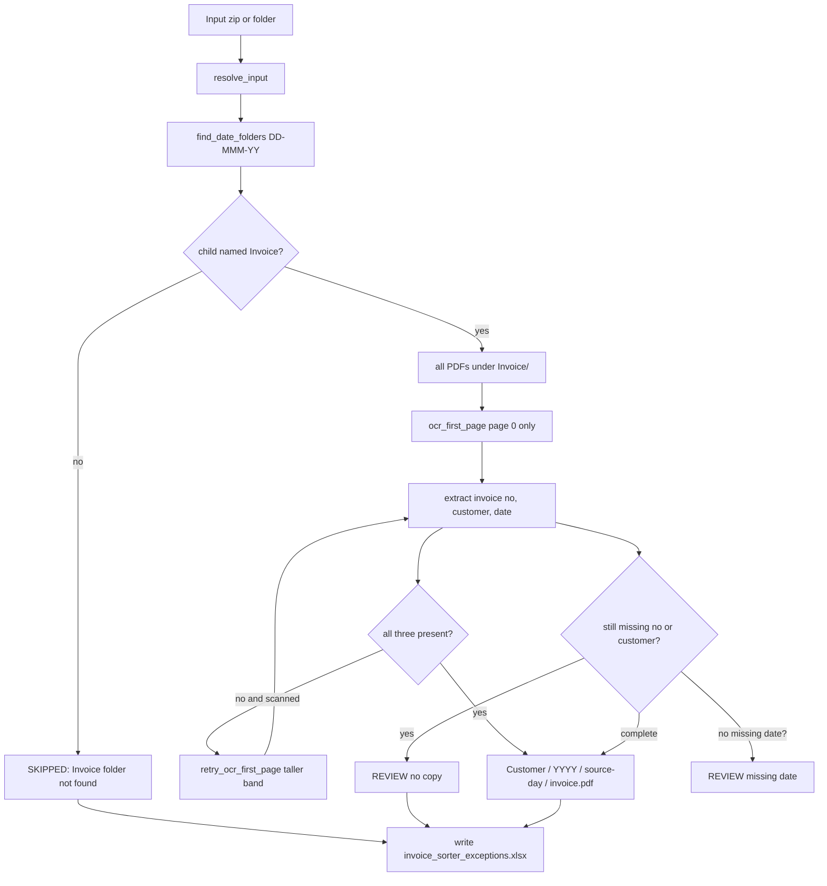

# Invoice Sorter — logic map (for debugging)

This document describes **every filing rule currently implemented**, where it lives, and what usually breaks. When a bug appears, start at the symptom table, then jump to the function listed.

Engine of record: `core/sorter.py`.  
UIs only call `process()` / `process_uploaded_zip()`; they do not re-implement extraction.

---

## 1. Product rules (what the code is trying to do)

| Rule | Implementation |
| --- | --- |
| Each PDF is one invoice package | `process_invoice_file` copies the whole file with `shutil.copy2`. No split. |
| Read page 1 only | `ocr_first_page` uses `doc[0]` only. Pages 2+ are never rendered. |
| Nested input `DD-MMM-YY/Invoice/` | `find_date_folders` + `invoice_pdfs_in` |
| Ignore PIS | A day folder without a child named `Invoice` (any case) is `SKIPPED`. PIS PDFs are never listed as jobs. |
| Output `Customer / YYYY / source-day / invoice.pdf` | Built in `process_invoice_file` |
| Year = printed invoice date | `extract_invoice_date` → `year_folder = str(invoice_date.year)` |
| Missing printed date → REVIEW | Second REVIEW branch in `process_invoice_file` |
| Source day folder kept as-is | `date_folder_name_for` returns the folder **name string**, not a reformatted date |
| Duplicate dest → `__DUPLICATE.pdf` | If `{invoice_no}.pdf` exists, copy to `{invoice_no}__DUPLICATE.pdf` (one suffix only) |
| Uncertain → REVIEW | No copy. Row goes to Excel `Could_not_read` |
| Customer = billed-to, official list | `customers.txt` via `match_official_customer` |
| Rapid Machining folder spelling | Official list line `Rapid Machining Tech.Pvt.Ltd.` |
| Porite folder spelling | Official list line `Porite India Pvt. Ltd.` |
| Do not use street `182` as customer | `_usable_customer_name` rejects `^\d+\s*,` and all-digit names |
| Do not use PAN `AAACH1727L` as invoice no | `_plausible_gst_invoice_number` + prefer `\b20\d{9}\b` |
| Invoice nos look like `20` + 9 digits | First successful match in extraction |

---

## 2. File layout

```
invoice_sorter_app_v2/
  core/sorter.py          All OCR, extract, copy, Excel report
  customers.txt           Official billed-to names (from Summary.xlsx)
  desktop_app.py          EXE / python entry; crash log + MessageBox
  ui/desktop.py           PySide6 window; calls process() on a QThread
  app.py                  Optional Streamlit UI (same engine)
  tests/test_invoice_sorter.py
  tests/pdf_fixtures.py    Builds sample GST-like PDFs
  packaging/              PyInstaller spec, HOW_TO_RUN.txt, build bat
  tools/benchmark.py       Times process()
  run.bat                 If InvoiceSorter.exe exists, launch it; else Python 3.12 source
```

---

## 3. End-to-end pipeline



Entry: `process(root, output_root, progress=None)`.

1. `resolve_input` — directory as-is, or unzip to `{stem}_extracted` beside the zip.
2. Recurse for folders matching `^\d{1,2}-[A-Za-z]{3}-\d{2}$`.
3. For each day folder, look for a **direct child** directory whose name is `invoice` (case-insensitive). Not a nested `Invoice` two levels down unless it is that child.
4. Queue PDFs. `worker_count()` is **1 during pytest**, else `min(2, cpu)`.
5. Each PDF: `process_invoice_file`, or on exception a REVIEW row `Could not read file: …`.
6. Always write `output_root / invoice_sorter_exceptions.xlsx`.

---

## 4. Input discovery

### `DATE_FOLDER_RE`

Must match the **entire** folder name: `1-Sep-26`, `01-Sep-26`, `25-Jun-26`.  
`June 26` does **not** match; the day folders inside it do.

**Bug hint:** If nothing is processed, the zip/folder probably has no `DD-MMM-YY` directory names, or they have extra text (`01-Sep-26 Invoice`).

### `parse_date_folder`

Used only to **sort** day folders (`%d-%b-%y` then `%d-%B-%y`). Filing does **not** use this parsed date for `YYYY`.

### `date_folder_name_for(path, root)`

Walks `path` then parents until a name matches `DATE_FOLDER_RE` or `root`. Fallback: `path.parent.parent.name` (assumes `…/DD-MMM-YY/Invoice/file.pdf`).

**Bug hint:** A PDF not under a day folder can get a nonsense `date_folder` (e.g. `Invoice` or the zip extract root).

### `invoice_pdfs_in`

- `None` → SKIPPED (PIS-only days).
- Empty list `[]` → day is **not** skipped; no jobs from that day (silent: no row). That is a gap: empty `Invoice/` is not reported.

Only `.pdf` files, not starting with `.`.

### `resolve_input` zip behaviour

Extracts to `path.parent / f"{path.stem}_extracted"`.  
If that folder **already** contains any `DD-MMM-YY` dirs, it **does not re-extract**. Stale extract is a common “I updated the zip but output is old” bug.

Zip-slip: entries that resolve outside `dest` raise `ValueError`.

---

## 5. Page 1 read / OCR

### When OCR runs

`ocr_first_page`:

1. Open PDF with PyMuPDF (`fitz`).
2. Empty doc → `("", 0)`.
3. `page.get_text("text").strip()` length **≥ 40** → use embedded text, **no OCR**.
4. Else RapidOCR on a **header clip**.

**Bug hint:** A scanned page that still has a short junk text layer of 40+ characters skips OCR and extraction fails. Lowering 40 would OCR more; raising it would OCR more image PDFs that have tiny text layers.

### Header clip

`render_page_band(page, scale, fraction)`:

- Clip: `y=0` to `height * fraction`, full width.
- Default `OCR_SCALE = 1.2`, `HEADER_FRACTION = 0.4`.
- Retry: `OCR_RETRY_SCALE = 1.7`, `HEADER_TALL_FRACTION = 0.55`.

If the GST “Invoice No. & Date” line sits **below 40%** of the page, first pass misses it; retry may catch it at 55%. Below 55% → REVIEW.

### RapidOCR

`get_rapid_engine`: one engine **per thread** (`threading.local`).  
Classifier off, `max_side_len` 960, CPU ONNX only.

`ocr_image_rapid` joins `result.txts` with newlines.

### Retry

`retry_ocr_first_page` runs only if first pass missed invoice no **or** customer **or** date.

If embedded text ≥ 40 chars, retry **returns the original text unchanged** (no second OCR).

PaddleOCR runs only if `INVOICE_SORTER_USE_PADDLE` is `1`/`true`/`yes` **and** Rapid retry still has no invoice number. Default: Paddle off. Init failure sets engine to `False` permanently for the process.

### `looks_like_invoice_page`

Used in **tests**, not in `process_invoice_file`. Filing does **not** call this. Delivery challans become REVIEW because invoice number / customer / date extraction fails, not because this helper returns False.

---

## 6. Invoice number

`extract_invoice_number` in `core/sorter.py`.

1. `normalize_ocr_text`: NBSP → space; `lnvoice` → Invoice; `InvoiceNo` → `Invoice No`; `Inv. No` → `Invoice No`.
2. Take a window after `Invoice No` / `Invoice No. & Date` (up to 160 chars, stop before the word Invoice).
3. In that window, then in the **full** page, search `\b(20\d{9})\b` — **first match wins**.
4. Fallback: capture after `Invoice No` / `Invoice Number|#`, strip a trailing ` - DD/MM` date, then `_plausible_gst_invoice_number`.

`_plausible_gst_invoice_number`:

- Reject empty.
- Reject PAN `AAAAA9999A` and GSTIN-shaped tokens.
- Reject if the token contains `PAN` or `GSTIN`.
- Accept `20` + 9 digits, or any 8–14 digit string.

**Bug hints:**

- PAN on the same header row: OCR can glue `Invoice No. & Date : AAACH1727L - 11/04/2023`. The `20xxxxxxxxx` on the **next line** is still found because step 3 also searches the full page.
- If a **wrong** `20xxxxxxxxx` appears earlier in the labeled window (GSTIN fragments rarely match 11 digits starting with 20), the first match is used.
- Scanner names like `3345.pdf` are **not** used as the invoice number (destination name comes from extraction only).

---

## 7. Printed date / year folder

`extract_invoice_date`:

1. Same Invoice-No window (200 chars).
2. Prefer a date sitting after `\b20\d{9}\b`.
3. Else any `D/M/Y` or `D-M-Y` or `D.M.Y` in the window, then full page.
4. Year group is `\d{4}|\d{2}` so **`2024` is not parsed as year `20`**.
5. Two-digit year: `< 50` → 2000+yy else 1900+yy. Years outside 1990–2099 rejected.
6. Calendar validation via `date(year, month, day)` — Indian **DD/MM/YYYY** assumed (day first, then month).

**Not used for YYYY:** source folder `01-Sep-26` (that would be 2026). Tests lock this: printed `29/04/2024` + folder `01-Sep-26` → `…/2024/01-Sep-26/`.

**Bug hints:**

- US-style MM/DD/YYYY would swap day/month and can `ValueError` → None → REVIEW, or a wrong date that still validates (e.g. 05/06/2024).
- CIN / other dates on the page can win if they appear in the labeled window before a real invoice date and there is no `20xxxxxxxxx` prefix.
- Missing date with a valid invoice no + customer → REVIEW, reason contains `printed invoice date`. File is **not** copied.

---

## 8. Customer (billed-to)

### Official list

`load_official_customers` reads `app_root() / customers.txt`:

- Frozen EXE: folder of `InvoiceSorter.exe`.
- Source: `invoice_sorter_app_v2/`.

Blank lines and `#` comments skipped. Cached in `_OFFICIAL_CUSTOMERS` for the process lifetime (**changing the txt requires restart**).

### Token match (`match_official_customer`)

1. Prefer text between `Details Of Recipient` / `Billed to` and `Consignee` / `GSTIN` / `Place of Supply` / `Invoice No`.
2. Tokenize: `[A-Za-z0-9]+`, uppercased; drop PVT, LTD, LIMITED, PRIVATE, LLC, LLP, CO; fold TECHNOLOGIES→TECH, ENGINEERING→ENGG, etc.
3. Official name tokens must appear **in order** in the region (`_tokens_in_order`), or concatenated tokens as a substring of concatenated haystack (glued OCR like `PORITEINDIA`).
4. Single-token official names: token must be in haystack.
5. Score = `(len(needle), len(name))` — longer token lists win (avoids tiny names beating Rapid Machining).

Rapid Machining OCR `RAPID MACHINING TECHNOLOGIES PVT LTD (KOLHAPUR)` → tokens RAPID, MACHINING, TECH → matches `Rapid Machining Tech.Pvt.Ltd.`

Porite → `Porite India Pvt. Ltd.`

**Bug hints:**

- A **shorter** official name whose tokens are a subset of a longer one can still win if scored higher… actually longer needle wins. Opposite problem: a long wrong customer that still subsequence-matches.
- `HTF ACD GKN` vs `GKN driveline Pune` — subsequence matching can attach the wrong official row if both token lists appear in noisy full-page text. Billed region is tried **first**; if billed OCR is empty, full page is used (more collisions).
- Street `182, SHIROLI MIDC` is not in the official list; regex fallback would have used `182` historically; now `_usable_customer_name` rejects digit-comma prefixes.

### Fallback if no official match

Regex for `… PVT LTD / LIMITED / LLP` in billed region then full page. Skip HIGHTEMP (seller). Last resort: PORITE INDIA regex.

`canonicalize_customer_name` cuts at the first legal-suffix so `(KOLHAPUR)` and duplicated OCR lines drop.

`safe_name` for **folder** names: strip `<>:"/\|?*`, trailing `. ` (Windows). So official `Porite India Pvt. Ltd.` becomes folder `Porite India Pvt. Ltd` (trailing period removed). Excel/UI “customer” on COPIED rows is this **safe** name; REVIEW rows may still show the official string with a period.

---

## 9. Copy / duplicates / statuses

### COPIED

Path: `output_root / safe_name(customer) / str(year) / date_folder / {invoice_no}.pdf`

`source_pages` is `"1-{page_count}"` meaning the **package** has that many pages, not that they were OCR’d.

Lock `_OUTPUT_LOCK` around mkdir + exists + copy (thread-safe).

### DUPLICATE

Only if the exact dest file already exists. Second copy: `__DUPLICATE.pdf`. A **third** run of the same pair still targets `__DUPLICATE.pdf` and **overwrites** that duplicate file. There is no `__DUPLICATE2`.

Duplicates are still status `COPIED`, not REVIEW. They do **not** appear on the Excel exception sheets.

### REVIEW (not copied)

| Reason string | When |
| --- | --- |
| `Could not confidently extract invoice number/customer from page 1` | Missing number or customer after retry |
| `Could not confidently extract printed invoice date from page 1` | Number + customer OK, date missing |
| `Could not read file: {exc}` | Exception in `process_invoice_file` (corrupt PDF, OCR crash) |

### SKIPPED

`Invoice folder not found` for that `date_folder` name. No `source_file`.

---

## 10. Excel report

`EXCEPTION_REPORT_NAME = invoice_sorter_exceptions.xlsx`

Written every `process()` even if all copied (empty Could_not_read / Skipped sheets with headers).

| Sheet | Rows |
| --- | --- |
| Summary | Copied, REVIEW, Skipped, Total |
| Could_not_read | status == REVIEW |
| Skipped | status == SKIPPED |

Desktop: **Open Excel report** opens that path.  
Streamlit: `exception_report_bytes` download; zip of output also includes the xlsx via `zip_output_tree`.

---

## 11. UIs (no extra filing logic)

### Desktop `ui/desktop.py`

- Sort runs in `QThread` + `SortWorker` so the window does not freeze.
- REVIEW rows drawn in red.
- Progress callback `(done, total, name)`.

### `desktop_app.py` (frozen EXE)

- `chdir` to exe directory so `customers.txt` and RapidOCR models resolve.
- stdout/stderr → `invoice_sorter.log` beside the exe.
- Startup exceptions: log + Windows MessageBox.

### Streamlit `app.py`

Re-exports engine functions for older tests. Does not change extractors.

---

## 12. Environment / packaging

| Item | Behaviour |
| --- | --- |
| Python | 3.12 for source/`run.bat`. 3.14 has no Paddle wheel; RapidOCR is the default OCR. |
| `INVOICE_SORTER_USE_PADDLE` | Optional retry only |
| `OMP_NUM_THREADS` / `MKL_NUM_THREADS` | Forced to 1 at import |
| EXE | PyInstaller onedir; RapidOCR ONNX models must stay **next to** the exe |
| `run.bat` | If `InvoiceSorter.exe` is in the same folder, it launches the exe and never asks for Python |

---

## 13. Tests to run when changing a rule

`pytest tests -q` from `invoice_sorter_app_v2`.

| Concern | Test |
| --- | --- |
| `20xxxxxxxxx` not PAN | `test_extract_invoice_number_skips_pan_on_same_header_row` |
| Street 182 | `test_extract_customer_skips_street_number_182` |
| Rapid Machining collapse | `test_same_customer_collapses_kolhapur_folder_variants` |
| Year vs source folder | `test_output_year_comes_from_printed_date_not_source_folder` |
| Missing date REVIEW | `test_missing_printed_date_is_review` |
| Page 1 only | `test_ocr_pdf_reads_only_first_page`, `test_process_does_not_scan_supporting_pages` |
| PIS skip | `test_missing_invoice_folder_is_skipped` |
| Excel unread + skip | `test_exception_excel_lists_unreadable_and_skipped` |
| Duplicate file | `test_duplicate_destination_is_not_overwritten` |

Fixtures in `tests/pdf_fixtures.py` are **text** or rendered **images** of a fake GST header; they are not the client’s real `3344.pdf`.

---

## 14. Symptom → likely cause

| Symptom | First places to look |
| --- | --- |
| No files processed | `find_date_folders` / folder names not `DD-MMM-YY` |
| Whole day missing | No child folder named `Invoice`; check SKIPPED sheet |
| Filed under 182 | Official match failed **and** `_usable_customer_name` not applied (should be impossible on current fallback) |
| Filed as HIGHTEMP | Fallback regex; billed block missing so seller name matched — should skip HIGHTEMP; check OCR text |
| Folder is OCR garbage not customers.txt | `match_official_customer` failed; `customers.txt` missing next to exe (`app_root`) |
| Invoice file named AAACH1727L | `_plausible` / `20xxxxxxxxx` search failed |
| Year 2020 from date 2024 | Old regex `\d{2}` before `\d{4}` — must stay `\d{4}\|\d{2}` |
| Year 2026 from `01-Sep-26` | Year taken from folder by mistake — should only be `extract_invoice_date` |
| Supporting pages became their own invoices | `ocr_first_page` / `invoice_pdfs_in` must not walk non-Invoice dirs; splitting was removed |
| Same invoice overwritten | Third copy overwrites `__DUPLICATE.pdf` |
| Zip change ignored | Stale `{zipstem}_extracted` still has date folders |
| EXE asks for Python | User ran source `run.bat` / `.py`, not `InvoiceSorter.exe` |
| EXE silent crash | `invoice_sorter.log`; missing `customers.txt` or ONNX next to exe |
| Excel missing REVIEW row | Status is COPIED (including duplicates) or SKIPPED; only REVIEW is Could_not_read |

---

## 15. What the code does **not** do

- PIS processing (explicitly out of scope).
- Split multi-invoice PDFs (client: one PDF = one invoice).
- Use the source folder year as `YYYY`.
- Rename the source day folder (`01-Sep-26` stays `01-Sep-26`).
- Email or upload results.
- Require Streamlit for the client EXE.
